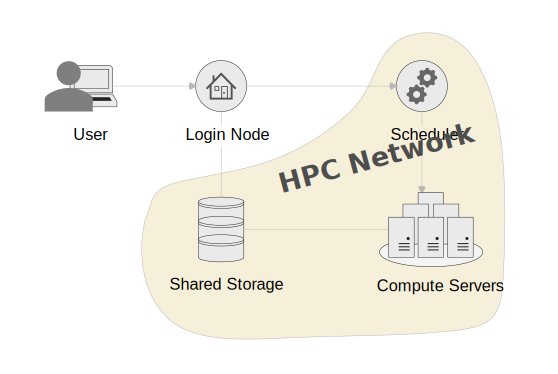

# Quickstart
This manual will give you all the information you need to use the cluster. You can find more guides in the documentation after this page, which will help you with more specialised issues. Or you can find some step by step tutorials you can follow, if this is easier for you to learn with.

## Introduction
HPC stands for High Performance Computing. Commonly this refers to a cluster of servers with ressources shared by multiple people. To manage resource allocation a scheduler is used that based on your definitions creates an isolated work environment to run code. As the resource is shared and not always used evenly, jobs can be queued for a while before they are run by the scheduler. No instant access to resources is quaranteed.

### How can HPC help you?
- Your work has outgrown your personal device's resources.
- Your work runs for hours or days and prevents you from using your personal device for other work.
- You do not have the right resources, like GPU, available to you in your personal device.
- You don't have the resources to aquire an own powerful computer and maintain it.

### Architecture
HPC can be built in in different configurations. This configuration is very popular and you will see it in many other HPCs



The HPC is build of these components:

- **Login Node**: This is the system all users interact with. If you want to interact with any of the other components, it has to be through the login node.
- **Scheduler**: This is the brain of the cluster. All your scheduling and status requests from the login node go this system. 
- **Compute Servers**: This symbolises all compute servers you could get allocations from through the scheduler. You should not access the servers directly unless you have a allocation. 
- **Shared Storage**: Most of the storage you interact with on the cluster is shared between the login node and all available compute servers. Therefore you can manage the data you need within your jobs from the login node.
- **HPC Network**: The network is shut off from the Campus network and therefore systems within it, will not be accessible to users outside of the login node.

### How does HPC work?
You will be submitting "work packages" in form of submission scripts, that define your resource requirement, an educated estimation of how long your job will run, and the workflow you want to run. Your work should run fully autonomous, this means no human interaction like GUI or console inputs. You can however, also have interactive sessions through HPC, these are useful for environment preparations, tests and debugging. 

Your work package will then be queued by the scheduler. The scheduler will decide where your job can run, based on your resource requirements described. Multiple jobs can run on one server. If there is enough resource available your job might run right away, otherwise it will be queued and run at a later time. You should be able to provide contact information, and the scheduler will keep you in the loop if your job has started, finished or failed. 

Scheduling is a complicated matter, and multiple factors play into the priority of your job, however generally, the smaller your job, the faster it will run, so it pays out to be efficient!

---

## Access the Cluster
After you got your account, to access the system, you log into a login node. The login node is the central point of access to the cluster for all users. This server is not very powerful and should therefore not be used for computational work. Any computational work should go through a job allocation on the scheduler.

### Connection Information
You have to be connected to the Campus network either via LAN, eduroam or VPN.

=== "Central"

    - **Hostname**: headnode04.cent.gla.ac.uk
    - **Username**: *University of Glasgow GUID*
    - **Password**: *GUID Password*

### Connecting via SSH
You will need to use `SSH` to connect to the login node and use the HPC. The simplest way to connect is by opening a console and connect using the preinstalled `SSH`utility of your device(If you are prompted for a password, it will not show up while typing):

```
ssh <username>@<hostaname>
```

We would recommend you use a SSH GUI client for regular access to the platform, as it allows you to save sessions, and `copy+paste` more easily. Example software are [PuTTY](https://www.putty.org/) and [MobaXterm](https://mobaxterm.mobatek.net/), however you can use whatever you prefer. 

---

## Data Management

---

## Scheduler

---

## Software

---

## Support

---
